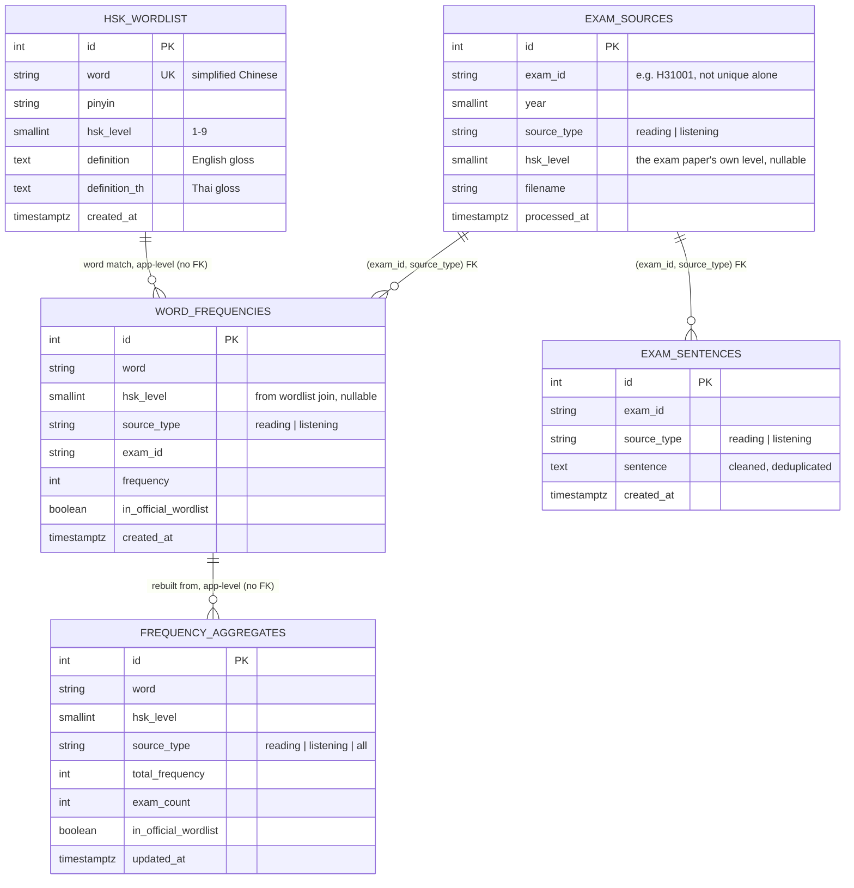
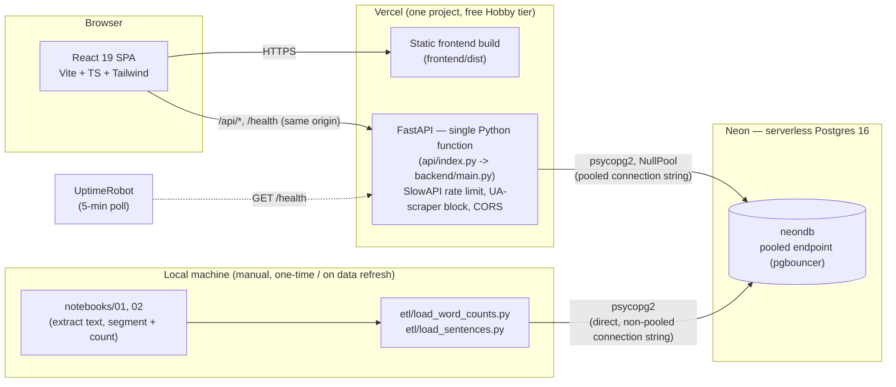
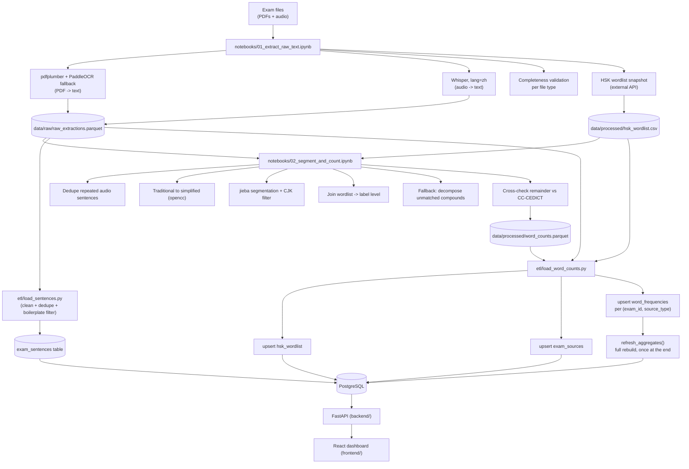
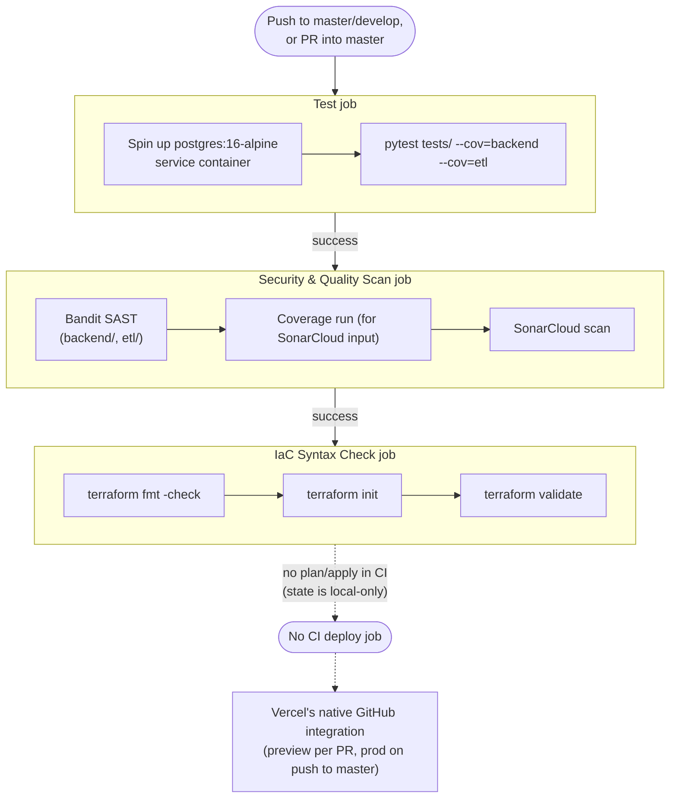
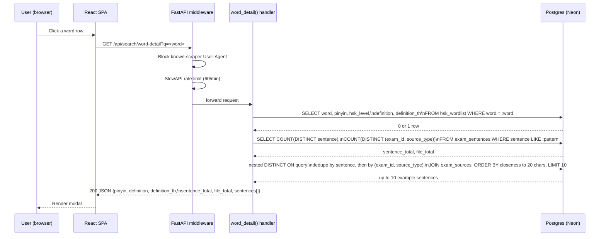
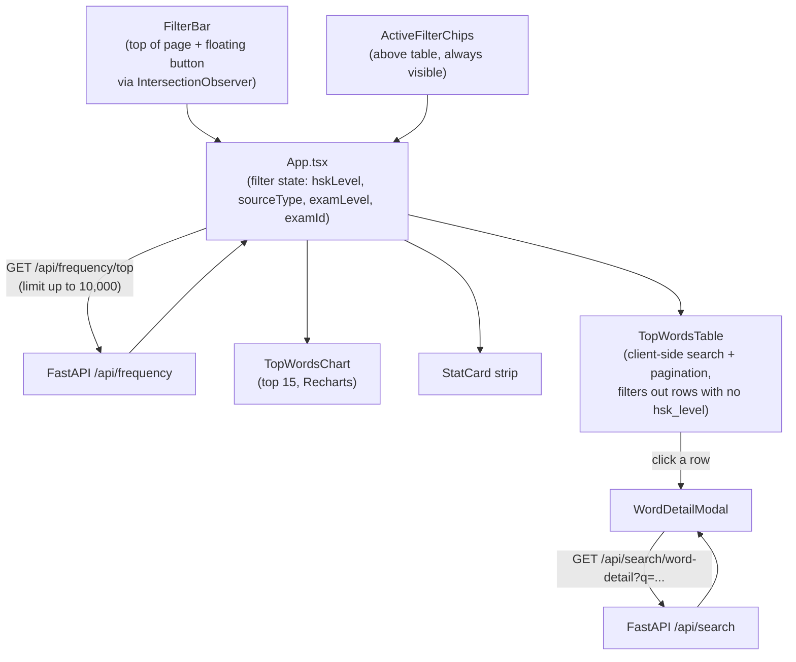

# Diagrams

Mermaid diagrams for the shapes of this system that are easier to see than to
read in prose. Rendered automatically by GitHub in this file. Source tables/
flows: [Database Schema](database-schema.md), [ETL Pipeline](etl-pipeline.md),
[DevSecOps Pipeline](devsecops.md), [Frontend Dashboard](frontend.md),
[Deploying to Vercel + Neon](deploy-vercel.md).

---

## Entity Relationship Diagram

Notes:
- `word_frequencies` and `exam_sentences` both key off the **composite**
  `(exam_id, source_type)`, not `exam_id` alone — see the "Fixed bug" note in
  [Database Schema](database-schema.md#exam_sources) for why that constraint
  shape matters.
- The `hsk_wordlist → word_frequencies` and `word_frequencies →
  frequency_aggregates` links are logical, not enforced foreign keys —
  `frequency_aggregates` is a full-table rebuild
  (`etl.load_to_db.refresh_aggregates`), not a live join.

---

## System Architecture

---

## ETL Pipeline

---

## DevSecOps / CI-CD Pipeline

---

## Request Sequence — `GET /api/search/word-detail`

The endpoint behind the word-detail modal (see
[Frontend Dashboard](frontend.md#word-detail-modal) and
[API Endpoints](api-endpoints.md)), and the one hit by the 2026-07-07 production
500 (schema drift between local Docker Postgres and Neon — see the README's
"Known bug" note).

---

## Frontend Data Flow

